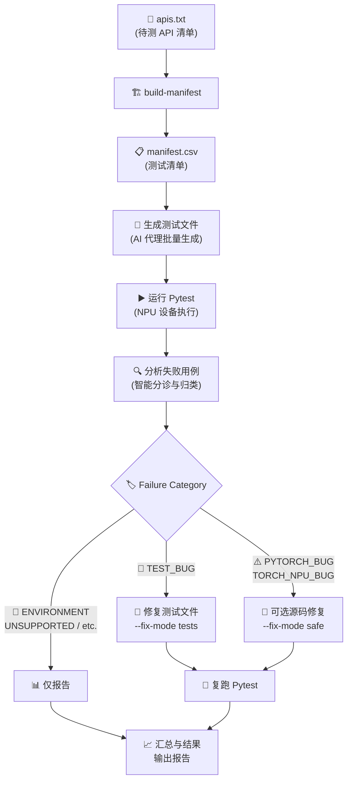

<div align="center">

# 🚀 PTA Testcase

### PyTorch NPU API 自动测试流水线

**AI 驱动的端到端测试生成 · 智能失败诊断 · 低风险自动修复**

[](#-环境要求)
[](#)
[](#)
[](#)

[快速开始](#-快速开始) · [工作流](#-工作流) · [CLI 参数](#%EF%B8%8F-cli-参数说明) · [配置同步](#-配置同步) · [贡献指南](#-贡献)

</div>

---

## 📖 简介

PTA Testcase 是一套面向 **Ascend NPU** 的 PyTorch API 自动化测试框架。只需提供一份 API 清单，即可由 AI 代理完成：

| 阶段 | 说明 |
|------|------|
| 🧪 **生成** | 为每个 API 自动生成覆盖全入参维度的 `pytest` 用例 |
| ▶️ **执行** | 在 NPU 设备上批量运行，收集 JUnit XML、stdout/stderr |
| 🔍 **分析** | 对失败用例进行智能分诊，归入 10 种失败类别 |
| 🔧 **修复** | 自动修复测试 Bug，可选低风险源码修复 |
| 📊 **报告** | 输出结构化 CSV/JSON/Markdown 报告，支持持续追踪 |

### ✨ 核心特性

- 🤖 **多后端支持** — 通过 `--cli-backend` 无缝切换 [Claude Code CLI](https://claude.com/claude-code)、[OpenAI Codex CLI](https://github.com/openai/codex) 与 [GitHub Copilot CLI](https://docs.github.com/copilot)
- 📁 **一 API 一文件** — 测试文件与 API 严格一一对应，统一放置于 `test/api_test/`
- 🎯 **功能覆盖优先** — 验证可调用性、返回类型、设备行为、异常场景；不做数值精度对比
- 🔄 **闭环流水线** — 生成 → 执行 → 分析 → 修复 → 回归，单命令完成
- 🛡️ **分级修复策略** — `tests` 模式只改测试代码，`safe` 模式允许最小化源码修复
- ⚙️ **配置同步** — 内置工具在 `.codex/`、`.github/` 与 `.claude/` 之间同步 Agent/Skill 配置

> 📌 完整的仓库约定和开发规范见 [AGENTS.md](./AGENTS.md)

---

## 🔄 工作流



### 📋 步骤详解

| # | 阶段 | 说明 |
|---|------|------|
| 1 | **📥 输入** | 解析 `apis.txt` 生成 `manifest.csv`，过滤 `status=pending` 的 API |
| 2 | **🤖 生成** | AI 代理批量生成测试文件，每个 API 对应一个 `test/api_test/test_*.py` |
| 3 | **▶️ 执行** | 运行 pytest 收集结果，保存日志及 JUnit XML |
| 4 | **🔍 分析** | 对失败用例诊断分类（如 `TEST_BUG`、`PYTORCH_BUG` 等） |
| 5 | **🔧 修复** | `--fix-mode tests` 修复测试 Bug；`--fix-mode safe` 可修复源码 Bug |
| 6 | **📈 回归** | 复跑受影响用例，输出最终汇总到 `runs/<run_id>/` |

---

## ⚡ 快速开始

### 1️⃣ 准备 API 清单

创建 `apis.txt`，每行一个 API（支持 `#` 注释和空行）：

```text
# tensor methods
Tensor.new_empty
Tensor.new_zeros

# torch namespace
torch.Event
torch.utils.swap_tensors
```

### 2️⃣ 一键运行

```bash
# 使用 Claude Code CLI（默认）
python -m scripts.pipeline run --input apis.txt --fix-mode tests

# 使用 Codex CLI
python -m scripts.pipeline run --input apis.txt --cli-backend codex --fix-mode tests

# 使用 Copilot CLI
python -m scripts.pipeline run --input apis.txt --cli-backend copilot --fix-mode tests

# 或使用快捷脚本
bash scripts/run_api_batch.sh apis.txt --fix-mode tests
```

### 3️⃣ 查看结果

```bash
# 🎯 最终交付报告（优先看这个！）
cat runs/<run_id>/final_verdict.md

# 结构化交付数据（可导入 Excel / Pandas）
cat runs/<run_id>/final_verdict.csv

# 流水线过程摘要（调试用）
cat runs/<run_id>/summary.md
```

---

## 🛠️ CLI 参数说明

```bash
python -m scripts.pipeline run --help
```

| 参数 | 阶段 | 默认值 | 说明 |
|------|------|--------|------|
| `--input` | 📥 输入 | **必填** | 数据源：`apis.txt` 或 `api_manifest.csv` |
| `--cli-backend` | 🌐 全局 | `claude` | AI 后端：`claude` \| `codex` \| `copilot` |
| `--report-dir` | 📂 输出 | `runs/` | Run Artifact 存放目录 |
| `--resume` | 🔄 恢复 | — | 传入已有 Run 目录路径，继续上次运行 |
| `--skip-generate` | 🤖 生成 | `false` | 跳过生成，复用已有测试文件 |
| `--max-workers` | 🤖 生成 | `8` | AI 代理并发预算 |
| `--run-engine` | ▶️ 执行 | `agent` | `agent`：AI 代理执行 \| `local`：本地 subprocess |
| `--analysis-engine` | 🔍 分析 | `agent` | `agent`：AI 智能诊断 \| `heuristic`：本地规则 |
| `--fix-mode` | 🔧 修复 | `tests` | `off` \| `tests` \| `safe` |
| `--debug` | 🐞 调试 | `false` | 保留完整 AI 代理日志 |

---

## 📚 常用命令

<details>
<summary><b>🔨 只生成 manifest</b></summary>

```bash
python -m scripts.pipeline build-manifest --input apis.txt --output api_manifest.csv
```
</details>

<details>
<summary><b>🔄 复用已有测试，只重跑执行和分析</b></summary>

```bash
python -m scripts.pipeline run --input api_manifest.csv --skip-generate --fix-mode off
```
</details>

<details>
<summary><b>💻 强制本地执行 pytest</b></summary>

```bash
python -m scripts.pipeline run --input apis.txt --run-engine local --fix-mode tests
```
</details>

<details>
<summary><b>📏 分析阶段使用本地启发式规则</b></summary>

```bash
python -m scripts.pipeline run --input apis.txt --analysis-engine heuristic --fix-mode tests
```
</details>

<details>
<summary><b>🤖 使用 Copilot CLI 后端</b></summary>

```bash
python -m scripts.pipeline run --input apis.txt --cli-backend copilot --fix-mode tests
```
</details>

<details>
<summary><b>🛡️ 允许低风险源码修复</b></summary>

```bash
python -m scripts.pipeline run --input api_manifest.csv --fix-mode safe
```
</details>

---

## 📥 输入格式

### `apis.txt`

每行一个 API 名称，自动转换为 manifest 记录（`canonical_name` + `file_name` + `status=pending`）。

### `api_manifest.csv`

```csv
raw_api_name,canonical_name,file_name,status,notes
Tensor.new_empty,Tensor.new_empty,test_Tensor_new_empty.py,pending,
torch.Event,torch.Event,test_Event.py,pending,
```

> 💡 `file_name` 为最终测试文件名，`status=pending` 的条目进入当前批次。

---

## 📦 输出工件

每次运行产生独立目录 `runs/<run_id>/`，包含：

| 工件 | 说明 |
|------|------|
| 🎯 `final_verdict.md` | **最终交付报告**：哪些 API 已确认、哪些需人工处理 |
| 📊 `final_verdict.csv` | 交付结论表（按优先级排序，可导入 Excel） |
| 📋 `manifest.csv` | 实时进度表，随流水线各阶段持续回写 |
| 📝 `pipeline.log` | 流水线阶段日志 |
| 🤖 `generation_summary.md` | AI 生成阶段摘要 |
| ▶️ `pytest_raw/*.stdout.log` | pytest 标准输出 |
| ❌ `pytest_raw/*.stderr.log` | pytest 错误输出 |
| 📊 `pytest_raw/*_junit.xml` | JUnit XML 报告 |
| 🤖 `pytest_raw/*.agent.md` | AI 执行阶段摘要 |
| 🔍 `analysis_inputs.json` | 分析阶段结构化输入 |
| 🏷️ `analysis_triage.json` | 分类结果 |
| 📄 `analysis_summary.md` | 人类可读分析摘要 |
| 🤖 `analysis_agent.md` | AI 分析原始总结 |
| 📊 `results.json` / `results.csv` | 结构化最终结果 |
| 📈 `summary.md` | 最终批次摘要 |
| 🔧 `fixes/*.md` | 单 API 修复摘要 |
| 🔧 `fixes/*.request.json` | 修复请求快照 |

---

## 🏷️ 失败分类体系

流水线将测试失败归入以下类别，并据此决定修复策略：

| 类别 | 含义 | 默认策略 |
|------|------|----------|
| 🐛 `TEST_BUG` | 测试代码本身的 Bug | ✅ 自动修复 |
| 🌐 `ENVIRONMENT_MISSING` | 缺少依赖或环境配置 | 📊 仅报告 |
| 🚫 `UNSUPPORTED_ON_NPU` | NPU 不支持的算子 | 📊 仅报告 |
| ⚠️ `PYTORCH_BUG` | PyTorch 框架 Bug | 🛡️ `--fix-mode safe` |
| ⚠️ `TORCH_NPU_BUG` | torch_npu 适配层 Bug | 🛡️ `--fix-mode safe` |
| 🔧 `OPERATOR_BUG` | 算子实现 Bug | 📊 仅报告 |
| 🔀 `API_BEHAVIOR_MISMATCH` | API 行为与文档不一致 | 📊 仅报告 |
| 🎲 `FLAKY_OR_UNSTABLE` | 非确定性失败 | 📊 仅报告 |
| 📉 `INSUFFICIENT_COVERAGE` | 覆盖不足 | 📊 仅报告 |
| ❓ `UNKNOWN` | 无法归类 | 📊 仅报告 |

> 📖 详细说明见 [docs/failure_taxonomy.md](./docs/failure_taxonomy.md)

---

## 📅 推荐工作流

```text
1. ✏️  编辑 apis.txt，加入需要测试的 API
2. 🚀  运行 python -m scripts.pipeline run --input apis.txt --fix-mode tests
3. 📈  查看 summary.md 了解批次整体结果
4. 🔍  查看 analysis_summary.md 了解失败分类
5. 📊  用 results.csv 过滤环境 / 框架 / 算子问题
6. 🛡️  确认后可选 --fix-mode safe 进行源码修复
```

---

## 🔄 配置同步

本仓库同时维护两套 AI CLI 配置，并提供内置同步工具：

| 目录 | 适用 CLI | 格式 |
|------|----------|------|
| `.codex/` | OpenAI Codex CLI | TOML agents + SKILL.md |
| `.github/` | GitHub Copilot CLI | Markdown agents + SKILL.md |
| `.claude/` | Claude Code CLI | CLAUDE.md + commands/*.md |

```bash
# 📤 从 Codex 同步到 Claude（推荐方向）
python -m scripts.config_sync --from codex --to claude

# 📤 从 Codex 同步到 Copilot
python -m scripts.config_sync --from codex --to copilot

# 🔍 查看各端配置差异
python -m scripts.config_sync --diff

# 👀 预览操作（不实际写入）
python -m scripts.config_sync --from codex --to claude --dry-run
```

> **💡 提示**：[SKILL.md](https://agentskills.io) 遵循 Agent Skills Open Standard，跨平台通用。Agent 定义格式由同步工具自动转换（TOML ↔ Markdown+YAML）。

### 🤖 内置 AI Agents

| Agent | 职责 |
|-------|------|
| `api_test_generator` | 为单个 API 生成 NPU pytest 测试 |
| `api_test_reviewer` | 审查测试文件是否符合规范 |
| `api_test_fixer` | 修复测试文件中的 Bug |
| `api_safe_fixer` | 低风险修复，可涉及 `pytorch/` 或 `ascend-pytorch/` |

### 🎯 内置 Skills

| Skill | 触发场景 |
|-------|----------|
| `batch-npu-api-test` | 批量处理 API 的生成 / 审查 / 修复 |
| `single-api-fix` | 单个 API 的修复请求分发 |

---

## 🗂️ 项目结构

```text
pta_testcase/
├── 📄 AGENTS.md                    # 仓库约定与开发规范（跨平台）
├── 📄 CLAUDE.md                    # Claude Code CLI 项目指令
├── 📄 README.md                    # 本文件
├── 📂 .claude/                     # Claude Code CLI 配置
│   ├── settings.json               #   权限与模型设置
│   └── commands/*.md               #   自定义命令（Skills）
├── 📂 .codex/                      # Codex CLI 配置
│   ├── agents/*.toml               #   Agent 定义
│   └── skills/*/SKILL.md           #   Skill 定义
├── 📂 .github/                     # Copilot CLI 配置（自动同步）
│   ├── agents/*.agent.md           #   Agent 定义
│   ├── skills/*/SKILL.md           #   Skill 定义
│   └── copilot-instructions.md     #   全局指令
├── 📂 scripts/
│   ├── 🐍 pipeline.py              # 主流水线（~1500 行）
│   ├── 📂 backends/                # CLI 后端抽象层
│   │   ├── base.py                 #   CliBackend ABC
│   │   ├── claude.py               #   ClaudeBackend
│   │   ├── codex.py                #   CodexBackend
│   │   └── copilot.py              #   CopilotBackend
│   ├── 🐍 config_sync.py           # 跨 CLI 配置同步工具
│   └── 🐚 run_api_batch.sh         # 快捷入口
├── 📂 test/api_test/               # 生成的测试文件（一 API 一文件）
├── 📂 docs/
│   └── failure_taxonomy.md         # 失败分类详细说明
├── 📂 runs/                        # Run Artifacts（每次运行一个子目录）
├── 📂 pytorch/                     # PyTorch 源码（submodule）
└── 📂 ascend-pytorch/              # torch_npu 源码（submodule）
```

---

## 🌐 环境要求

| 依赖 | 版本 | 用途 |
|------|------|------|
| Python | 3.11+ | 流水线运行时 |
| PyTorch | 2.x | 被测框架 |
| torch_npu | latest | NPU 后端 |
| pytest | 7+ | 测试执行 |
| PyYAML | — | 配置同步 |
| AI CLI | — | `claude`、`codex` 或 `copilot`（至少装一个） |

---

## 🤝 贡献

1. 修改 Agent 或 Skill 配置时，请在 `.codex/` 中编辑后运行同步：
   ```bash
   python -m scripts.config_sync --from codex --to copilot
   ```
2. 新增失败类别请同步更新 `docs/failure_taxonomy.md`
3. 测试文件遵循 [AGENTS.md](./AGENTS.md) 中的规范

---

<div align="center">

**Built with 🤖 AI-assisted development**

[Claude Code](https://claude.com/claude-code) · [Codex CLI](https://github.com/openai/codex) · [Copilot CLI](https://docs.github.com/copilot) · [Agent Skills Open Standard](https://agentskills.io)

</div>
